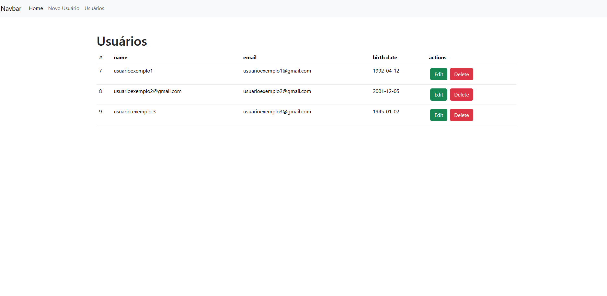

# PHP Admin CRUD

Este é um projeto de estudo desenvolvido para praticar e aprofundar conhecimentos em PHP. Ele consiste em um sistema básico de administração de usuários (CRUD - Create, Read, Update, Delete), utilizando PHP e MySQL, com estilização feita com Bootstrap.

## Funcionalidades

- **Criar**: Adicionar novos usuários com informações como nome, email, senha e data de nascimento.
- **Ler**: Visualizar uma lista de usuários cadastrados.
- **Atualizar**: Editar informações de usuários existentes.
- **Deletar**: Remover usuários do sistema.

## Tecnologias Utilizadas

- **PHP**: Linguagem de programação do backend.
- **MySQL**: Banco de dados relacional para armazenar informações dos usuários.
- **Bootstrap**: Framework CSS para estilizar o layout.

### Imagem do Sistema


## Instalação

1. Clone o repositório:
   ```bash
   git clone https://github.com/KaiD3v/php-admin-crud.git
   ```

